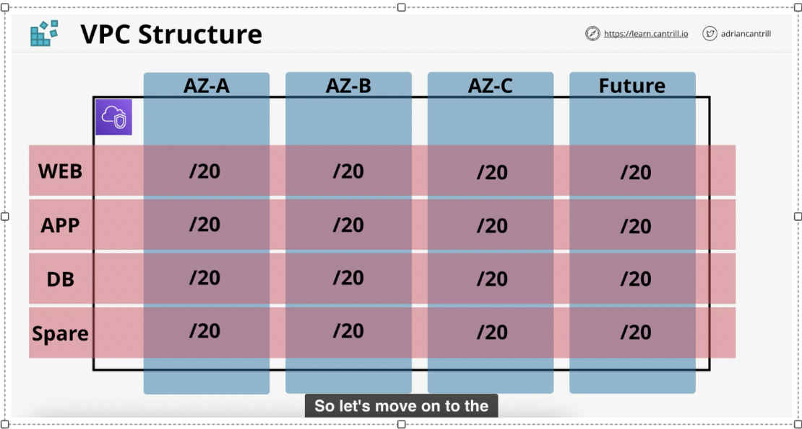

 # VPC basics

 1. VPC sizing and structures

     - Scenarios: 
        ○ Animal4Life has 3 offices - London, New York, Seattle
        ○ Field workers distributed globally - consume services from a range of locations - how they connected to bz? Web apps/ bz networks using virtual private network 
        ○ 3 existing networks which CIDRs of VPC cannot use and overlap with: 
            § On-premise in Brisbane : 192.168.10.0/24
            § AWS Pilot: 10.0.0.0/16 
            § Azure Pilot:172.31.0.0/16
            § Assume: 192.168.15.0/24 is used by London office
            § Assume: 192.168.20.0/24 is used by New York office
            § Assume: 192.168.25.0/24 is used by Seattle office
            § Vendors with their Google Cloud proof of concept cannot confirm which network they have with Google Cloud. The default range is 10.128.0.0/9 --> huge space to 10.255.255.255. Google default using /9 which is half of /8 network range
    - Thinking process: 
        * Azure is using range that same as default VPC  which is 172.31.0.0/16 --> cant use the default VPC
        *  IP plan ? Number of networks needed --> start from how many AWS regions that bz operates in? choose the highest number of regions and add a buffer /reserve region
        *  VPC is regional resilience --> 1 VPC per region per account 
        * Inside 1 VPC we have multiple subnets --> 1 subnet per Availability zone per tier (tiers inlcude GENERAL, DEV, PROD, BUFFER)
        * Always start with 3 AZ because it will work in almost any region + 1 spare
        * Structure of one VPC: 
        

        * Refer to the pdf IP plans to create 1 sample VPC in AWS, then create subnets for the VPC, Internet gateway, route tables to turn Web tiers into public subnets ( the subnets that can access to the internet)

